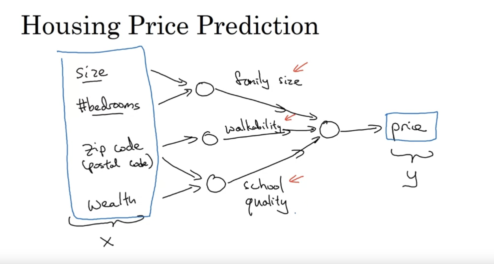
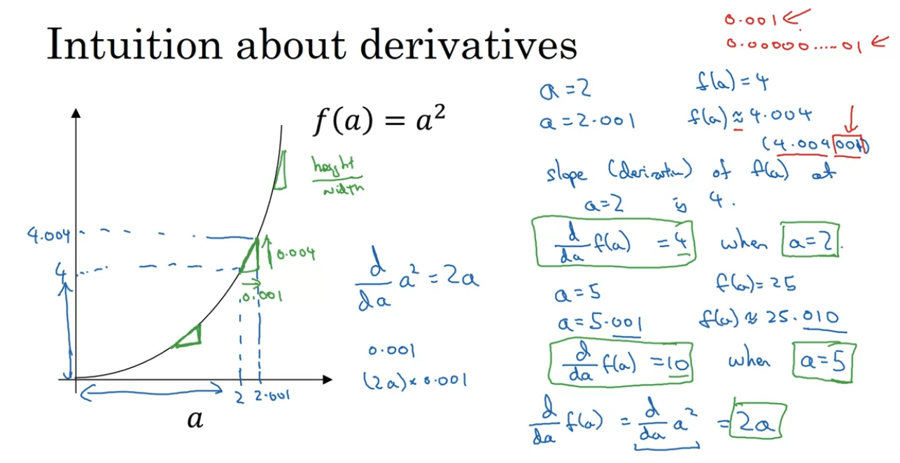
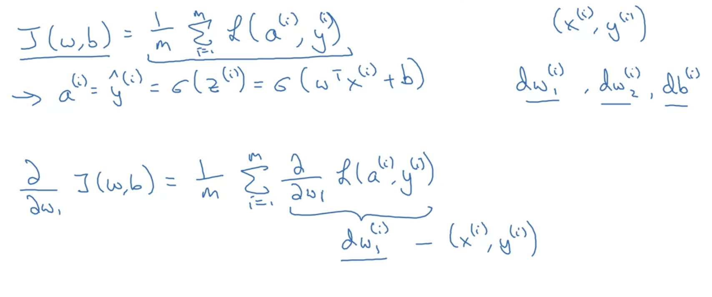
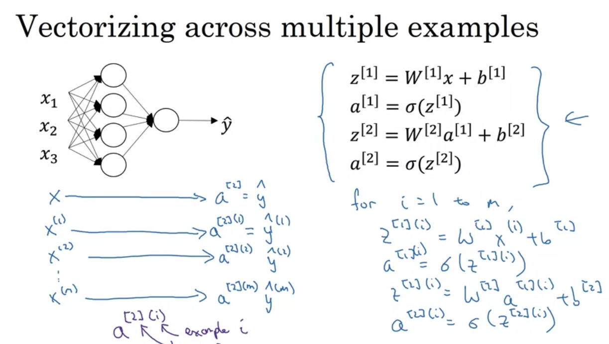
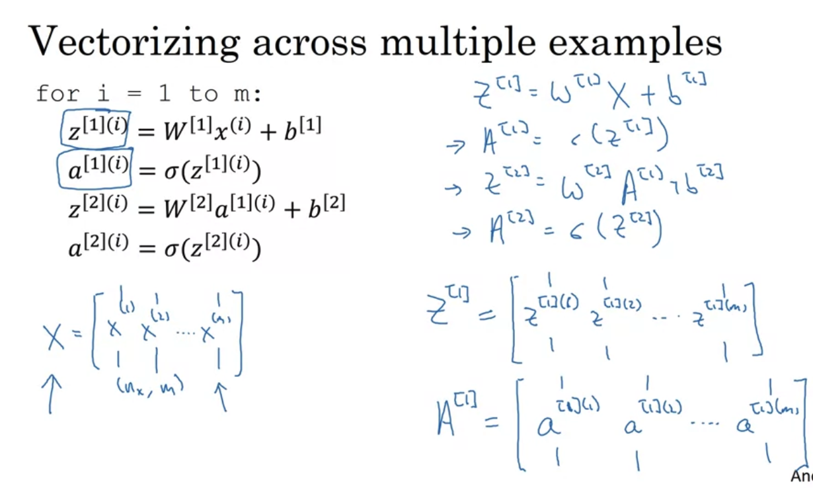

# Understanding Deep Learning

## What's a Neural Network?

- For a house price prediction, we want to predict the price of a house based on their sizes
  - The size is the `x` (`x` could also be a combination of size, #bedrooms, zip code (postal code), wealth)
    - The family size, walkability, and school quality will be figure out by the neural network (they are also called `hidden units`)
    - size/#bedrooms: family size
    - zip code: walkability
    - zip code/wealth: school quality
  - The price is the `y`
  - The circle in between is a "neuron" and it implements a function that takes the input (size), compute its linear function, takes a max of zero, and output the estimated price

## Supervised Learning

- structure data: e.g. table
- unstructure data: e.g. audio, image, text

## Why is Deep Learning taking off?

- For traditional machine learning algorithms, the performance improves with the increase of the amount of data but it plateaus with huge amounts of data.
- We went from a small amount of data to a huge amount of data (IoT, smartphones)
- From small neural net to a medium to a large neural net, with the increase of data, the performance is getting better and better
- Scale drives the deep learning progress
  - The size of the neural network (a lot of hidden units, parameters, connections)
  - The size of data
  - Scale of computation
  - Better algorithms. e.g. going from sigmoid to relu makes gradient descent runs much faster
  - With all this, the iteration of the idea -> experiment -> code cycle is much faster which also contributes to the deep learning progress

## Binary Classification

- e.g. input as an image -> whether it's cat (1) or non cat (0)

## Logistic Regression

- Given x, we want the y^ (prediction, estimate of y): the P(y=1|x)
  - Given a picture, what's the probability of this picture to be a cat
- Instead of a linear regression, logistic regressions use a sigmoid function to predict a binary classification
  - z = w⋅x+b
  - if 𝜎(𝑧) > 0.5, the model may predict class 1
  - if 𝜎(𝑧) < 0.5, it may predict class 0

## Logistic Regression Cost Function

- The loss function computes the error for a single training example
- The cost function is the average of the loss functions of the entire training set.

## Gradient Descent

- Repeat
  - w = w - α (dJ(w) / dw)
    - α = learning rate
    - J(w) = cost function
    - dJ(w) / dw = how much the cost function changes in respect to w -> the slope of the function

### Intuition about Derivatives

- Derivatives are the slope of a function, in other words, it's how much the function changes if we change its variable
  - How much `f(x)` changes, if we change the `x`
  - The slope is a segment of y (height) divided by the segment of x (width): df(x)/dx
  - For a linear function, the slope is always the same
  - For a exponential, the slope keeps changing. e.g. f(x) = x², the rate of change (derivative) is `2x`, which means that if we shift 1 to the right, we shift 2 upwards. The slope is different for different values of x

## Computation Graph

- Computing J
  - J(a, b, c) = 3 (a + bc)
    - bc = u
    - a + bc = v
  - u = bc
  - v = a + u
  - J = 3v
- Computing derivatives
  - Using chain rule to calculate how much one variable changes the output
  - e.g. how much `J` changes if we change `a`
  - dJ/da = dJ/dv * dv/da
    - dJ/dv: how much `J` changes if we change `v`
    - dv/da: how much `v` changes if we change `a`
    - we need to propagate backwards to calculate the derivatives of each

## Gradient Descent

- `z` is the linear transformation: `wt * x + b`
- `a` is the prediction, the activation function applied to `z` (sigmoid in this case)
- The loss function is computed this way in respect to `a`
- We go backwards using the derivative of the loss function in respect to `a`, `z`, `w1`, and `w2`

- Cost function `J` is the mean of the sum of all loss functions
- Gradient descent is the derivative of the cost function in respect to the weight
  - Compute the linear combination `z`
  - Compute the applied activation function `a` 
  - Compute the loss function
    - And then the cost function (mean of the sum of all loss functions)
  - Compute the derivative of `z`
  - Compute the derivative of `w1`
  - Compute the derivative of `w2`
  - Compute the derivative of `b`
  - Update the `w1`, `w2`, and `b`

## Vectorization

- Vectorization is getting rid of explicit for loops in code

## Neural Network

- Each node does two things
  - Compute the linear combination
  - Compute the activation function
- A superscript is the layer and the subscript is the node in the layer

- For X,
  - the horizontal is all the training examples
  - the vertical is each feature
- When computing Z and A, 
  - the horizontal is all the training examples
  - the vertical is the hidden units (nodes) in the hidden layer