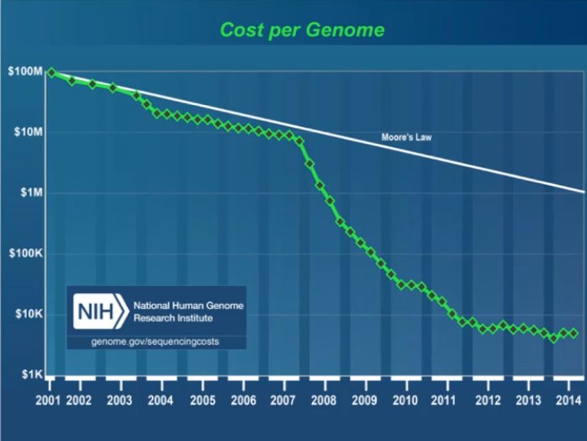

# Algorithms for DNA Sequencing

Next Generation Sequencing (NGS) in 2007 (second generation sequencing or massive parallel sequencing)



Get the sequence of DNA as a string getting the side of the double helix at a time

- double helix
- base pairs: A-T and C-G


DNA sequencing

- short snippets of DNA (reads): genome is orders of magnitude larger than these shorts snippets
  - chromosomes (1.000.000) vs reads (100)
- use massive parallel sequencing

## String definitions

- String `S` is a finite sequence of characters and { A, T, C, G }
- number of characters using `len(S)`
- empty string when `len(S)` is 0

If we have double stranded DNA, and we knew the sequence along one of those strands from top to bottom, the reverse complement would give us the sequence of the other strand from bottom to top:

```python
def reverse_complement(s):
  complement = { 'A': 'T', 'C': 'G', 'G': 'C', 'T': 'A' }
  return ''.join(complement[char] for char in reversed(s))
```
