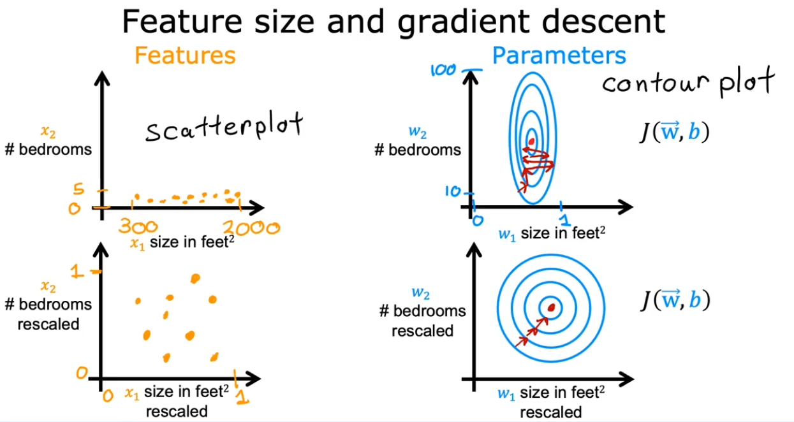

# Machine Learning with Python

## Machine Learning Algorithms

- Supervised Learning
- Unsupervised Learning
- Reinforcement Learning

## Supervised Learning

- Learn input to output
- The model learns from being give the right answers (labels/value)
- Examples
  - Input: email -> output: spam? (spam filtering)
  - Input: audio -> output: transcript (speech recognition)
  - Input: english -> output: spanish (machine translation)
  - Input: image -> position of cars (self-driving car)
  - Input: image of phone -> defect? (visual detection)
- Regression
  - Housing price prediction: the relationship between the size of the house and its price
  - It needs to predict numbers in infinitely many possible outputs
- Classification
  - Breast Cancer detection: the relationship between the tumor size and the diagnosis (malignant/benign) - only two possible outputs/categories
  - The target value is commonly called categories, labels, or classes
  - We can have more than 1 input (e.g. age and tumor size to classify the cancer tumor). The algorithm draws a boundary 'line' so in one side the class is benign and the other is malignant

## Unsupervised Learning

- The data is not associated with any output Y. There's no "correct answer" or label
- The data is not being supervised. The model finds something interesting in unlabeled data
- Clustering is a type of unsupervised learning, where it divide the data into different groups/clusters
  - e.g. clustering DNA microarray
    - type of people based on their genes
    - each column is a person
    - each row is a gene (eye color, hair color)
- Anomaly detection: find unusual data points
- Dimensionality reduction: compress the dataset into a smaller one (compress data using fewer numbers)

## ML Models Terminology

- Training set: data used to train the model
- Input variable: feature, predictor
- Output variable: target
- m: number of training examples
- (x, y): single training example
- w (weight) and b (bias) are parameters/coefficients of the model

## Linear Regression

- `Linear function`: with random Ws and Bs, the model produces a function. For linear regression, the function is a line
  - Draw a line describing the data points (dataset behavior)
  - The line is a function built by the learning algorithm (model)
  - The function receives an input (features) and output a prediction (y-hat), the estimated value of y
  - The idea of the model is to ask what's the math formula for `f`
- `Cost function`: it measures how well the model is performing
  - The model fits the data and we measure with the cost function if it's performing well
  - Model fitting is the process of choosing weights and biases so y-hat is close to the target value y
    - It will find best weights and biases
  - The cost function `J(w, b)` is the measure of the difference between the y-hat and the target value y
  - One way to computing the cost function is to use MSE or mean squared error
    - sum of the squared differences of y-hat and y
  - The goal of the model is to minimize the cost function `J(w, b)`
- `Gradient Descent`
  - Update the weight parameter relative to the cost function `J`
  - If `J` is a concave up parabola and the initial weight draws the point on the left side of the parabola, gradient descent will increase the weight because it has a negative slope because `w = w - alpha * (negative number)`
  - If the initial weight is on the right side, gradient descent will decrease the weight because the the slope is a positive number
  - Near the local minimum, the derivative becomes smaller because the update steps become smaller
  - Gradient descent stops at the local minimum
    - For a convex function (parabola), the local minimum is the global minimum
- `Learning rate`
  - Small alpha: small baby steps in the gradient descent when updating the weight
  - Big alpha: large steps and the cost function can not reach the most optimized weight
- `Multiple linear regression`: multiple features
  - e.g. size in feet², number of bedrooms, number of floors, age of home in years, price
  - f(x) = w1x1 + w2x2 + w3x3 + w4x4 + ... b
    - w will be a vector of all the weights for each feature
    - b is a single number
  - f(x) = w.x + b (w and x being vectors)
    - w.x is a dot product between vectors

## Feature Scaling

- Features with different scales would lead to a tall/skinny contour
  - Any change in w1 (smaller features) has large impact on the cost J
  - With feature scaling, the contour looks like a circle and gradient descent can find a more direct path to the global minimum
