# Math for Machine Learning with Python

- [Algebra Fundamentals](#algebra-fundamentals-equations-graphs-and-functions)
  - [Intro to equations](#intro-to-equations)
  - [Linear Equations](#linear-equations)
  - [Systems of Equations](#systems-of-equations)
  - [Exponentials & Logarithms](#exponentials--logarithms)
  - [Polynomials](#polynomials)
  - [Factorization](#factorization)
  - [Quadratic Equations](#quadratic-equations)
  - [Functions](#functions)
- [Calculus: Derivatives and Optimization](#calculus-derivatives-and-optimization)
  - [Rate of Change](#rate-of-change)
  - [Limits](#limits)
  - [Differentiation and Derivatives](#differentiation-and-derivatives)
  - [Critical Points](#critical-points)
  - [Partial Derivatives](#partial-derivatives)
- [Vectors](#vectors)
  - [What's a vector](#whats-a-vector)
  - [Calculating Magnitude](#calculating-magnitude)
  - [Calculating Direction](#calculating-direction)
  - [Vector Addition](#vector-addition)
  - [Vector Multiplication](#vector-multiplication)
- [Matrices](#matrices)
  - [What's a matrix](#whats-a-matrix)
  - [Matrix Multiplication](#matrix-multiplication)
  - [Matrix Division](#matrix-division)
  - [Systems of Equations](#systems-of-equations-1)
- [Statistics](#statistics)
  - [Data Introduction](#data-introduction)
  - [Statistics Fundamentals](#statistics-fundamentals)
  - [Comparing Data](#comparing-data)
  - [Probability](#probability)

## Algebra Fundamentals: Equations, Graphs, and Functions

### Intro to equations

Starting with an equation: `2x + 3 = 9` to find the the `x`. `x = 3`

```python
x = -41
x + 16 == -25 # True
```

Working with fractions

```python
x = 45
x / 3 + 1 == 16 # True
```

Variables in both sides

```python
x = 1.5
3 * x + 2 == 5 * x -1 # True
```

### Linear Equations

Creating a dataframe with the `x` and `y` columns and their values

```python
import pandas as pd
from matplotlib import pyplot as plt

df = pd.DataFrame({'x': range(-10, 11)})
df['y'] = (3 * df['x'] - 4) / 2
```

Simple way to plot and show the graph

```python
plt.plot(df.x, df.y, color="grey")
plt.xlabel('x')
plt.ylabel('y')
plt.grid()
plt.show()
```


Annotate the points when x = 0 and y = 0

```python
plt.annotate('x-intercept', (1.333, 0))
plt.annotate('y-intercept', (0, -2))
plt.show()
```

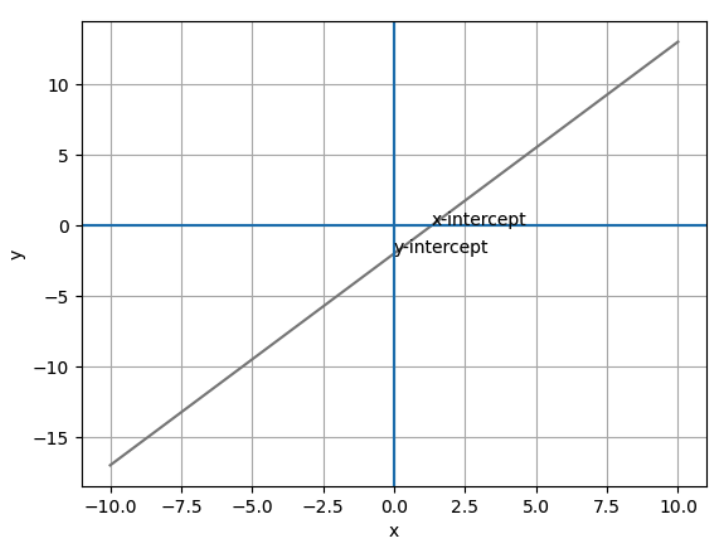

Finding the slope through the equation:

```
slope = Δy/Δx
```

Slope is usually represented by the letter `m`

```
m = (y2 - y1) / (x2 - x1)
```

Getting these two points, we can infer the slope value: (0, -2), (6, 7)

```
m = (7 - (-2)) / (6 - 0)
m = 1.5
```

It means that when moving one unit to the right (x-axis), we need to move 1.5 units up (y-axis) to get back to the line.

```python
m = 1.5
yInt = -2
mx = [0, 1]
my = [yInt, yInt + m]
```

### Systems of Equations

In equations with two variables `x` and `y`, we can use elimination to find the values when the intersect with each other

```
x + y = 16
10x + 25y = 250
```

With elimination, you'll find out that `x = 10` and `y = 6` when the lines intersect.

```python
x = 10
y = 6
print((x + y == 16) & ((10 * x) + (25 * y) == 250))
```

When plotting the lines of those equations, we get this graph


Here's how we generate the code

```python
chipsAll10s = [16, 0]
chipsAll25s = [0, 16]

valueAll10s = [25, 0]
valueAll25s = [0, 10]

plt.plot(chipsAll10s, chipsAll25s, color='blue')
plt.plot(valueAll10s, valueAll25s, color="orange")
plt.xlabel('x (£10 chips)')
plt.ylabel('y (£25 chips)')
plt.grid()

plt.show()
```

### Exponentials & Logarithms

Exponentials have a simple case that's squaring a number: `2² = 2 x 2 = 4`.

```python
2 ** 2 # 4
```

Radicals (roots) is useful to calculate a solution for exponential

```
?² = 9
√9 = 3
∛64 = 4
```

In Python we can use `math.sqrt` to get the square root of a number and a trick to get the cube root.

```python
math.sqrt(25) # 5
round(64 ** (1. / 3)) # 64 ^ 1/3 = ∛64 = 4
```

To find the exponent for a given number and base, we use the logarithm

```
4 ^ ? = 16
log₄(16) = 2
```

The `math` module has a `log` function that receive the number and the base

```python
math.log(16, 4) # 2.0
math.log(29) # 3.367295829986474
math.log10(100) # 2.0
```

Solving equations with exponentials:

```
2y = 2(x^4)((x^2 + 2x^2) / x^3)
2y = 2(x^4)(3x^2 / x^3)
2y = 2(x^4)(3x^-1)
2y = 6(x^3)
y = 3(x^3)
```

We can exemplify this with Python

```python
df = pd.DataFrame ({'x': range(-10, 11)})

# add a y column by applying the slope-intercept equation to x
df['y'] = 3 * df['x'] ** 3 # this is the equation we simplified above

plt.plot(df.x, df.y, color="magenta")
plt.xlabel('x')
plt.ylabel('y')
plt.grid()
plt.axhline()
plt.axvline()
plt.show()
```

It generates this graph:

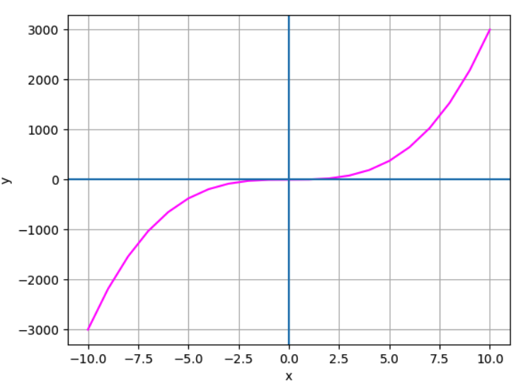

### Polynomials

A polynomial is an algebraic expression containing one or more _terms_.

```
12x³ + 2x - 16
```

The terms themselves include:

- Two coefficients(12 and 2) and a constant (-16)
- A variable (x)
- An exponent (<sup>3</sup>)

Simplifying the polynomial:

x<sup>3</sup> + 2x<sup>3</sup> - 3x - x + 8 - 3
3x<sup>3</sup> - 4x + 5

And we can compare both equations in Python

```python
from random import randint
x = randint(1,100)

(x**3 + 2 * x**3 - 3 * x - x + 8 - 3) == (3 * x**3 - 4 * x + 5)
# True
```

### Factorization

`Factorization` is the process of restating an expression as the _product_ of two expressions.

-6x<sup>2</sup>y<sup>3</sup>

You can get this value by performing the following multiplication:

(2xy<sup>2</sup>)(-3xy)

So, we can say that **2xy<sup>2</sup>** and **-3xy** are both factors of **-6x<sup>2</sup>y<sup>3</sup>**.

```python
from random import randint
x = randint(1,100)
y = randint(1,100)

(2 * x * y**2) * (-3 * x * y) == -6 * x**2 * y**3
```

The `Greatest Common Factor` (GCF) is the highest value that is a multiple of both number `n1` and number `n2`.

We can apply this idea to polynomials too.

15x<sup>2</sup>y
9xy<sup>3</sup>

The GCF of these polynomial is `2xy`

Factorization is useful for expressions like the differences of squares:

x<sup>2</sup> - 9
x<sup>2</sup> - 3<sup>2</sup>
(x - 3)(x + 3)

We generalize this idea to this expression: a<sup>2</sup> - b<sup>2</sup> = (a - b)(a + b)

Ensure this is true:

```python
from random import randint
x = randint(1,100)

(x**2 - 9) == (x - 3) * (x + 3)
```

This is also true for perfect squares

x<sup>2</sup> 10x + 25
(x - 5)(x + 5)
(x + 5)<sup>2</sup>

And we can generalize to this expression: (a + b)<sup>2</sup> = a<sup>2</sup> + 2ab + b<sup>2</sup>

Ensure this with Python

```python
from random import randint
a = randint(1,100)
b = randint(1,100)

a**2 + b**2 + (2 * a * b) == (a + b)**2
```

### Quadratic Equations

Use the complete the square method to solve quadratic equations. Take this following equation as an example:

x<sup>2</sup> + 24x + 12<sup>2</sup>

Can be factored to this:

(x + 12)<sup>2</sup>

OK, so how does this help us solve a quadratic equation? Well, let's look at an example:

y = x<sup>2</sup> + 6x - 7

Let's start as we've always done so far by restating the equation to solve **_x_** for a **_y_** value of 0:

x<sup>2</sup> + 6x - 7 = 0

Now we can move the constant term to the right by adding 7 to both sides:

x<sup>2</sup> + 6x = 7

OK, now let's look at the expression on the left: _x<sup>2</sup> + 6x_. We can't take the square root of this, but we can turn it into a trinomial that will factor into a perfect square by adding a squared constant. The question is, what should that constant be? Well, we know that we're looking for an expression like _x<sup>2</sup> + 2**c**x + **c**<sup>2</sup>_, so our constant **c** is half of the coefficient we currently have for **_x_**. This is **6**, making our constant **3**, which when squared is **9** So we can create a trinomial expression that will easily factor to a perfect square by adding 9; giving us the expression _x<sup>2</sup> + 6x + 9_.

However, we can't just add something to one side without also adding it to the other, so our equation becomes:

x<sup>2</sup> + 6x + 9 = 16

So, how does that help? Well, we can now factor the trinomial expression as a perfect square binomial expression:

(x + 3)<sup>2</sup> = 16

And now, we can use the square root method to find x + 3:

x + 3 = √16

So, x + 3 is **-4** or **4**. We isolate **_x_** by subtracting 3 from both sides, so **_x_** is **-7** or **1**:

x = -7, 1

### Functions

Functions are usually the same how it's in programming. Data in, data out.

f(x) = x<sup>2</sup> + 2
f(3) = 11

```python
def f(x):
  return x**2 + 2

f(3) # 11
```

Bounds of function: domain

Imagine a function `g(x)` = (12 / 2x)<sup>2</sup>, where `{x ∈ ℝ | x ≠ 0}`

In Python:

```python
def g(x):
  if x != 0:
    return (12 / 2 * x)**2

x = range(-100, 101)
y = [g(a) for a in x]
```

Conditional: for `k(x)`

```
{
  0, if x = 0,
  1, if x = 100
}
```

In Python:

```python
def k(x):
  if x == 0:
    return 0
  elif x == 100:
    return 1

x = range(-100, 101)
y = [k(a) for a in x]
```

## Calculus: Derivatives and Optimization

### Rate of Change

`q(x) = 2x + 1`

In a period of 10s, we can plot this into a graph with Python

```python
def q(x):
  return 2 * x + 1

x = np.array(range(0, 11))
plt.xlabel('Seconds')
plt.ylabel('Meters')
plt.xticks(range(0, 11, 1))
plt.yticks(range(0, 22, 1))
plt.grid()
plt.plot(x, q(x), color='green')
plt.show()
```

Plotting this graph:

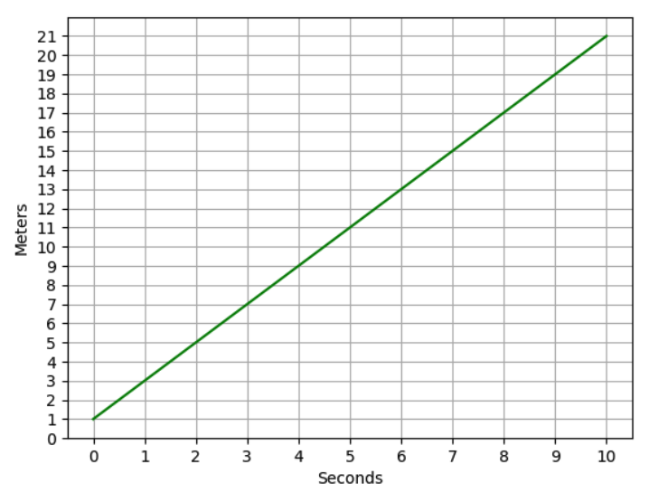

For this equation `q(x) = 2x + 1`, we can say the rate of change is `2`. Generalizing, we having `f(x) = mx + C`, `m` is the rate of change.

We calculate the rate of change the same as the slope:

```
m = Δy/Δx
```

We can calculate the average rate of change between two points for a quadratic function like `r(x) = x² + x`.

It's possible to do it between the first and the last point of the function or in a period of time.

```python
x = np.array(range(0, 11))
s = np.array([2,7])

x1 = s[0]
x2 = s[-1]
y1 = r(x1)
y2 = r(x2)
a = (y2 - y1)/(x2 - x1)

plt.xlabel('Seconds')
plt.ylabel('Meters')
plt.grid()
plt.plot(x,r(x), color='green')
plt.plot(s,r(s), color='magenta')
plt.annotate('Average Velocity =' + str(a) + ' m/s',((x2+x1)/2, (y2+y1)/2))
plt.show()
```

This plots the behavior of the function and average velocity:


### Limits

In a quadratic equation we have a bunch of points in the curve and we can plot like this:

```python
def f(x):
  return x**2 + x

x = list(range(0,5))
x.append(4.25)
x.append(4.5)
x.append(4.75)
x.append(5)
x.append(5.25)
x.append(5.5)
x.append(5.75)
x = x + list(range(6,11))

y = [f(i) for i in x]

plt.xlabel('x')
plt.ylabel('f(x)')
plt.grid()
plt.plot(x,y, color='lightgrey', marker='o', markeredgecolor='green', markerfacecolor='green')
plt.show()
```

Generating this graph:

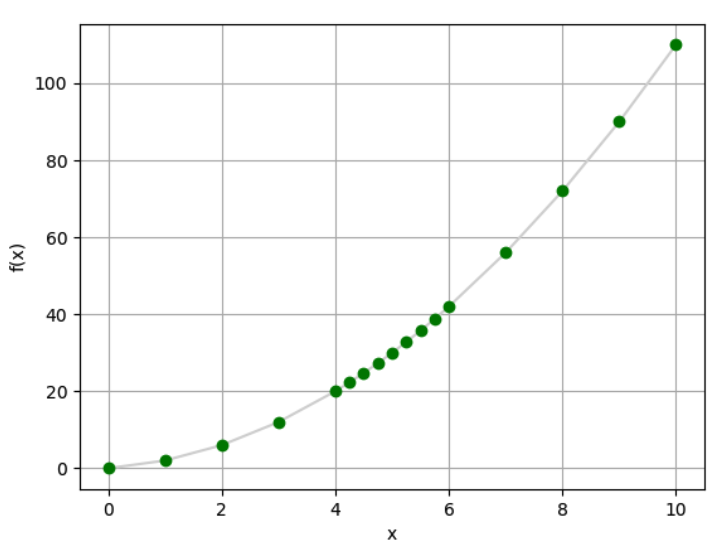

But we can still see gaps between points. And now we need to understand the concept of limits.

Not all functions are continuous. Take this function as example:

```
g(x) = -(12/2x)², where x ≠ 0
```

`x` can't be `0` because any number divided by `0` is `undefined`.

```python
def g(x):
  if x != 0:
    return -(12/(2 * x))**2

x = range(-20, 21)
y = [g(a) for a in x]

plt.xlabel('x')
plt.ylabel('g(x)')
plt.grid()
plt.plot(x,y, color='green')
plt.show()
```

Plotting `g(x)`, we get this graph:

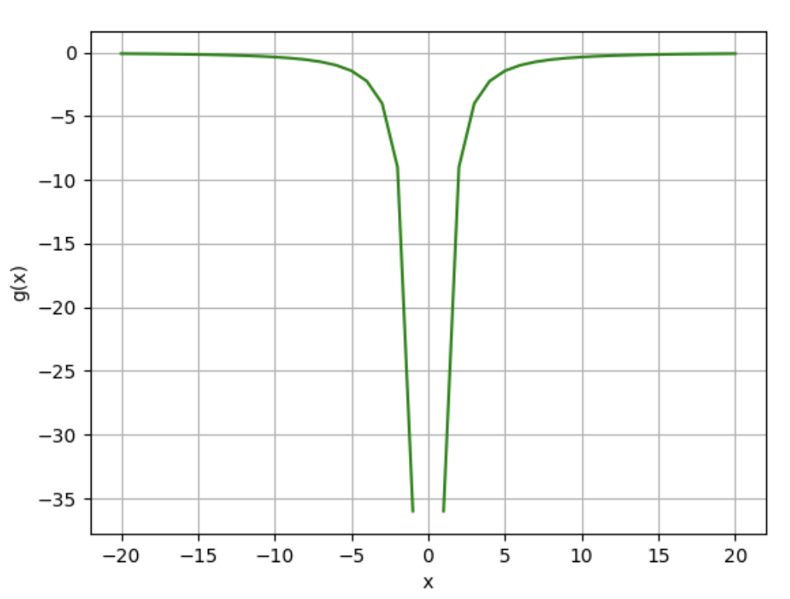

The function `g(x)` is non-continuous at `x = 0`

Limits can be applied to continous functions like `a(x) = x² + 1`

When `x` is approaching `0`, `a(x) = 1`.

That's because when `x` is slightly greater than `0` and slightly smaller than `0` (e.g. 0.000001 and -0.000001), the result will be slightly greater than `1` and slightly smaller than `1`, respectively.

This is how we write it: when `x` approaching `0`, the limit of `a(x)` is `1`.

`lim x->0 a(x) = 1`

We can also apply this concept to non-continuous points. Take this function as example: `b(x) = -2x²/x`, where `x ≠ 0`.

Let's plot it with Python

```python
def b(x):
  if x != 0:
    return (-2*x**2) * 1/x

x = range(-10, 11)
y = [b(i) for i in x]

plt.xlabel('x')
plt.ylabel('b(x)')
plt.grid()
plt.plot(x,y, color='purple')
plt.show()
```

Here's how it looks like in a graph:

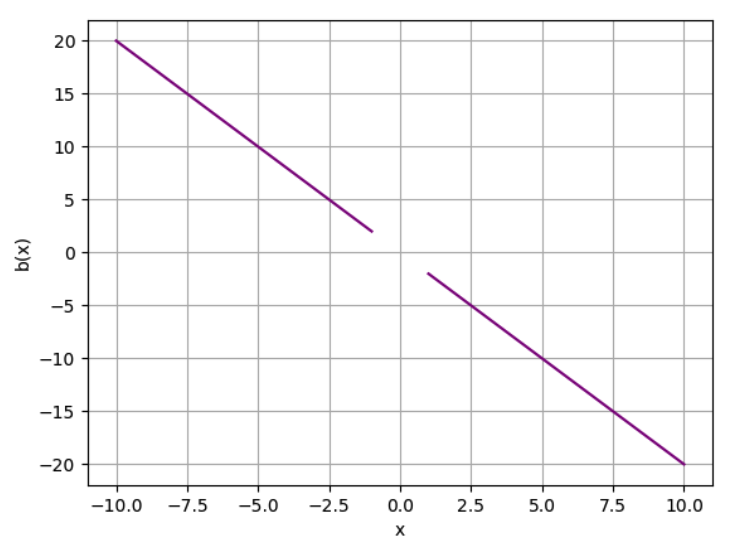

`x` approaching `0` from positive and negative sides equals `0`

- `lim x -> 0⁺ b(x) = 0`
- `lim x -> 0⁻ b(x) = 0`

We can also approach infinite. Take this function: `d(x) = 4 / (x - 25)`, where `x ≠ 25`

```python
def d(x):
  if x != 25:
    return 4 / (x - 25)

x = list(range(-100, 24))
x.append(24.9)
x.append(25)
x.append(25.1)
x = x + list(range(26, 101))
y = [d(i) for i in x]

plt.xlabel('x')
plt.ylabel('d(x)')
plt.grid()
plt.plot(x,y, color='purple')
plt.show()
```

We plot this graph:

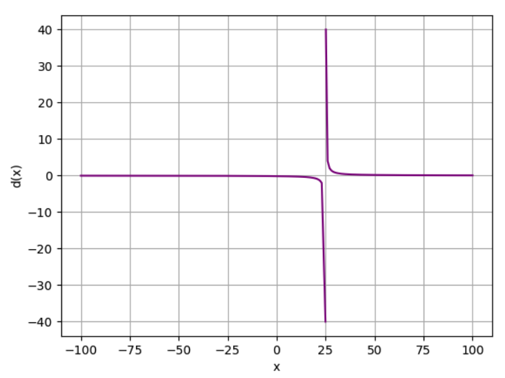

Approaching from negative and positive sides result in infinite.

- -♾️ when approaching from the negative side: lim x->25 d(x) = -♾️
- +♾️ when approaching from the positive side: lim x->25 d(x) = +♾️

We can use factorization when direct substitution doesn't work. Take this function as example:

```
g(x) = (x² - 1) / (x - 1)
```

If we calculate the limit of `x` approaching `1`, it won't work. The denominator can't be `0`.

But if we use factorization, we can get an answer for this limit. Remember this generalization?

```
a² - b² = (a - b)(a + b)
```

We can use this rule for our `g(x)` function.

```
x² - 1 = (x - 1)(x + 1)
g(x) = (x - 1)(x + 1) / (x - 1)
g(x) = x + 1
```

Now we can calculate the limit of `x` approaching `1`:

```
lim x->1 g(x) = x + 1
lim x->1 g(x) = 2
```

Let's plot the graph:

```python
def g(x):
  if x != 1:
    return (x**2 - 1) / (x - 1)

x= range(-20, 21)
y =[g(i) for i in x]
zx = 1
zy = zx + 1

plt.xlabel('x')
plt.ylabel('g(x)')
plt.grid()
plt.plot(x, y, color='purple')
plt.plot(zx, zy, color='red', marker='o', markersize=10)
plt.annotate(str(zy), (zx, zy), xytext=(zx - 2, zy + 1))
plt.show()
```

Generating this graph:


We can use pretty much the same idea using the rationalization.

Limits also have rules of operations: addition, substraction, multiplication, division, etc.

Addition:

```
lim x->a (j(x) + l(x)) = lim x->a j(x) + lim x->a l(x)
```

Subtraction:

```
lim x->a (j(x) - l(x)) = lim x->a j(x) - lim x->a l(x)
```

Multiplication:

```
lim x->a (j(x) • l(x)) = lim x->a j(x) • lim x->a l(x)
```

Division:

```
lim x->a (j(x) / l(x)) = lim x->a j(x) / lim x->a l(x)
```

Exponentials and roots:

```
lim x->a (j(x))ⁿ = (lim x->a j(x))ⁿ
```

### Differentiation and Derivatives

Calculating the slope `m`:

```
m = Δf(x) / Δx
```

or

```
m = (f(x₁) - f(x₀)) / (x₁ - x₀)
```

Making an adjustment with an increment for `x`, let's call it `h`, we have:

```
m = (f(x + h) - f(x)) / h
```

The shortest distance between `x` and `x + h` is when `h` is the smallest possible value, in other words, when `h` approaches `0`.

```
f'(x) = lim h->0 (f(x + h) - f(x)) / h
```

We call it the derivative of the original function.

It's important because it provides valuable information about the behavior of a function at that specific point.

- Rate of change: how the function is changing at that specific point (crucial for understanding the dynamics of the system being modeled)
- Slope of the Tangent Line: useful for approximating the function locally by a linear function (simplify analysis and computation)
- Understanding Function Behavior: the sign of the derivative indicates whether the function is increasing or decreasing at that point
  - Find critical points: local maxima, minima, or saddle points
  - Important for optimization

**Differentiability**: be _differentiable_ at every point; that is, you are able to calculate the derivative for every point on the function line

To be differentiable at a given point:

- The function must be _continuous_ at that point.
- The tangent line at that point cannot be vertical
- The line must be _smooth_ at that point (that is, it cannot take on a sudden change of direction at the point)

Take this function as an example:

```
q(x) = {
  40,000 / x², if x < -4,
  (x² - 2)·(x - 1), if x ≠ 0 and x ≥ -4 and x < 8,
  (x² - 2), if x ≠ 0 and x ≥ 8
}
```

Let's plot it with Python

```python
def q(x):
  if x != 0:
    if x < -4:
      return 40000 / (x**2)
    elif x < 8:
      return (x**2 - 2) * x - 1
    else:
      return (x**2 - 2)

x = list(range(-10, -5))
x.append(-4.01)
x2 = list(range(-4,8))
x2.append(7.9999)
x2 = x2 + list(range(8,11))

y = [q(i) for i in x]
y2 = [q(i) for i in x2]

plt.xlabel('x')
plt.ylabel('q(x)')
plt.grid()
plt.plot(x,y, color='purple')
plt.plot(x2,y2, color='purple')
plt.scatter(-4,q(-4), c='red')
plt.annotate('A (x= -4)',(-5,q(-3.9)), xytext=(-7, q(-3.9)))
plt.scatter(0,0, c='red')
plt.annotate('B (x= 0)',(0,0), xytext=(-1, 40))
plt.scatter(8,q(8), c='red')
plt.annotate('C (x= 8)',(8,q(8)), xytext=(8, 100))
plt.show()
```

Here's the graph:

The points marked on this graph are non-differentiable:

- Point **A** is non-continuous - the limit from the negative side is infinity, but the limit from the positive side &approx; -57
- Point **B** is also non-continuous - the function is not defined at x = 0.
- Point **C** is defined and continuous, but the sharp change in direction makes it non-differentiable.


**Derivative Rules**

- `f(x) = C`, where `C` is a constant, then `f'(x) = 0` (it's a horizontal lie)
- If `f(x) = Cg(x)`, then `f'(x) = Cg'(x)`
- If `f(x) = g(x) + h(x)`, then `f'(x) = g'(x) + h'(x)` (this also applies to subtraction)
- The power rule: `f(x) = xⁿ` ∴ `f'(x) = nxⁿ⁻¹`
- The product rule: `d/dx[f(x)·g(x)]` = `f'(x)·g(x) + f(x)·g'(x)`
- The quotient rule: `r(x) = s(x) / t(x)` ∴ `r'(x) = (s'(x)·t(x) - s(x)·t'(x)) / [t(x)]²`
- The chain rule: `d/dx[O(i(x))] = o'(i(x))·i'(x)`

### Critical Points

Take this function:

```
k(x) = -10x² + 100x + 3
```

To determine the derivative function of the original function:

```
k'(x) = -20x + 100
```

And plotting with Python:

```python
def k(x):
  return -10 * (x**2) + (100 * x)  + 3

def kd(x):
  return -20 * x + 100

x = list(range(0, 11))
y = [k(i) for i in x]
yd = [kd(i) for i in x]

plt.xlabel('x (time in seconds)')
plt.ylabel('k(x) (height in feet)')
plt.xticks(range(0,15, 1))
plt.yticks(range(-200, 500, 20))
plt.grid()
plt.plot(x,y, color='green')
plt.plot(x,yd, color='purple')
plt.show()
```

It generates these two functions in the graph:


Some interpretation of this graph:

- The point where the derivative line crosses 0 on the y-axis is also the point where the function value stops increasing and starts decreasing. When the slope has a positive value, the function is increasing; and when the slope has a negative value, the function is decreasing.
- The tangent line (the slope in each point) is rotating clockwise throughout the graph.
- At the highest point, the tangent line would be perfectly horizontal, representing a slope of 0.

To illustrate the interpretation, we have three tangent lines: one when the function is increasing, one when the function is decreasing, and the another one when it's horizontal, in other words, when the slope is 0.

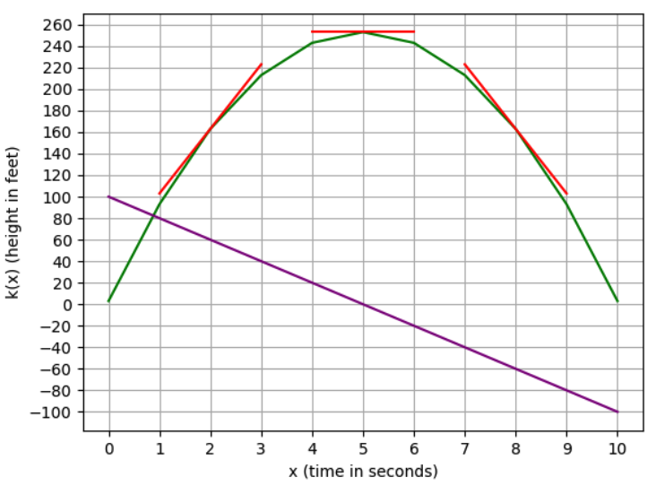

Critical points are represented when the derivative function crosses `0`. It indicates that the function is changing direction.

**Finding minima and maxima**

```
k(x) = -10x² + 100x + 3
k'(x) = -20x + 100
-20x + 100 = 0
20x = 100
x = 100 / 20
x = 5
```

The derivative will be 0 when `x` is 5.

**Second Order Derivatives**

We can use second order derivatives to determine if the critical point is minima or maxima.

```
k(x) = -10x² + 100x + 3
k'(x) = -20x + 100
k''(x) = -20
```

The second derivative has a constant value, so we know that the slope of the prime derivative is linear, and because it's a negative value, we know that it is decreasing.

When the derivative crosses 0, it we know that the slope of the function is decreasing linearly, so the point at `x = 0` must be a maximum point.

The same happens when finding a minimum point.

```
w(x) = x²+ 2x + 7
w'(x) = 2x + 2
w''(x) = 2
```

It's a positive constant, so it's increasing when crossing `0`, therefore, it means this a minimum point.

Optimization is one of the application of finding critical points.

Imagine a formula representing the expected number of subscriptions to Netflix:

```
s(x) = -5x + 100
```

In this case, `s(x)` being the number of subscriptions and `x` the monthly fee.

The monthly revenue can be calculated as the subscription volume times the monthly fee:

```
r(x) = s(x)·x
r(x) = -5x² + 100x
```

First find the prime derivative:

```
r'(x) = -10x + 100
```

Then find the critical points (when `r'(x)` equals `0`):

```
r'(x) = -10x + 100
0 = -10x + 100
10x = 100
x = 10
```

And finally checking if the critical point is a maximum or minimum point using the second order derivative:

```
r'(x) = -10x + 100
r''(x) = -10
r''(10) = -10
```

A negative constant value in the second order derivative tells it's a maximum point. In other words, the maximum monthly fee for Netflix is `10`.

### Partial Derivatives

How do we calculate the derivate of multi variables functions?

```
f(x, y) = x² + y²
```

We use partial derivatives:

- The derivative of `f(x, y)` with respect to `x`
- The derivative of `f(x, y)` with respect to `y`

Starting with the partial derivative with respect to `x`:

```
∂f(x, y) / ∂x
∂(x² + y²) / ∂x
∂x² / ∂x
2x
```

Because `y` doesn't depend on `x`, `∂y² / ∂x = 0`

We get the same idea when calculating the partial derivative with respect to `y`:

```
∂f(x, y) / ∂y
∂(x² + y²) / ∂y
∂y² / ∂y
2y
```

We use partial derivatives to compute a gradient. A gradient is a way to find the analog of the slope for multi-dimensonal surfaces.

You can find minimum and maximum of curves using derivatives. In the same way, you can find the minimum and maximum of surfaces by following the gradiennt and finding the points were the gradient is zero in all directions.

For this function:

```
f(x, y) = x² + y²
```

We have

```
∂f(x, y) / ∂x = 2x
∂f(x, y) / ∂y = 2y
```

The gradient is a 2-dimensional vector:

```
grad(f(x, y)) = [2x, 2y]
```

We can use the concept of gradient in a minimization algorithm called gradient descent method, where you take a guess, compute the gradient, take a small step in the direction of the gradient, and determine if it's close to `0` (the gradient will be `0` at the minimum).

The cost function provides a way to evaluate the performance of a model. Gradient descent is an optimization algorithm used to minimize the cost function. One type of cost functions is the Mean Squared Error (MSE). Minimizing the cost function means

- Finding the model parameters that result in the smallest possible cost, indicating the best fit to the data.
- Lower values of the cost function indicate a model that better predicts the actual outcomes.

## Vectors

### What's a vector

A numeric element that has magnitude and direction.

- magnitude: distance
- direction: which way is headed

Let's see an example:

```bash
v = (2, 1)
```

For this vector, we need to move 2 units in the `x` dimension and 1 unit in the `y` dimension. It's a way of saying the directions you need to follow to get to there from here.

```python
import numpy as np
import matplotlib.pyplot as plt

vector = np.array([2, 1])
origin = [0], [0]
plt.axis('equal')
plt.grid()
plt.quiver(*origin, *vector, scale=10, color='r')
plt.show()
```

This will plot the vector in the graph:

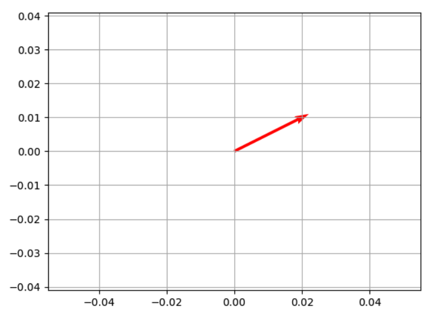

### Calculating Magnitude

We can use the Pythagorean theorum and calculate the square root of the sum of the squares.

```bash
v = √v₁² + v₂²
```

For our vector example: `v = (2, 1)`, here's how I calculate it:

```bash
v = √2² + 1²
v = √4 + 1
v = √5 ≈ 2.24
```

In Python, we can use the `math` module:

```python
import numpy as np
import math

vector = np.array([2, 1])
math.sqrt(vector[0]**2 + vector[1]**2) # 2.23606797749979
```

### Calculating Direction

To calculate the direction (amplitude), we use trigonometry and get the angle of the vector by calculating the inverse tangent `tan⁻¹`.

```bash
tan(𝛉) = 1 / 2
𝛉 = tan⁻¹(0.5) ≈ 26.57°
```

We can confirm it calculating it in Python

```python
import math
import numpy as np

v = np.array([2,1])
vTan = v[1] / v[0] # 0.5
vAtan = math.atan(vTan)
math.degrees(vAtan) # 𝛉 = 26.56505117707799
```

### Vector Addition

Let's add two vectors:

- `v = (2, 1)`
- `s = (-3, 2)`

```python
import numpy as np
import matplotlib.pyplot as plt

v = np.array([2, 1])
s = np.array([-3, 2])

vecs = np.array([v, s])
origin = [0], [0]
plt.axis('equal')
plt.grid()
plt.ticklabel_format(style='sci', axis='both', scilimits=(0,0))
plt.quiver(*origin, vecs[0, 0], vecs[0, 1], color=['r', 'b'], scale=10)
plt.quiver(*origin, vecs[1, 0], vecs[1, 1], color=['r', 'b'], scale=10)
plt.show()
```

Let's calcula the sum of `v` and `s`, resulting in `z`:

```bash
z = v + s
z = (2, 1) + (-3, 2)
z = (-1, 3)
```

Generate the new vector `z` with Python:

```python
import numpy as np
import matplotlib.pyplot as plt

v = np.array([2, 1])
s = np.array([-3, 2])
z = v + s

vecs = np.array([v, s, z])
origin = [0], [0]
plt.axis('equal')
plt.grid()
plt.ticklabel_format(style='sci', axis='both', scilimits=(0,0))
plt.quiver(*origin, vecs[0, 0], vecs[0, 1], color=['r', 'b'], scale=10)
plt.quiver(*origin, vecs[1, 0], vecs[1, 1], color=['r', 'b'], scale=10)
plt.quiver(*origin, vecs[2, 0], vecs[2, 1], color=['r', 'b'], scale=10)
plt.show()
```

Here's the plot:


### Vector Multiplication

We have 3 ways of performing vector multiplication:

- Scalar multiplication
- Dot product multiplication
- Cross product multiplication

Scalar multiplication is multiplying a vector by a single numeric value.

Let's multiply vector `v` by `2`, resulting in a vector `w`.

```bash
v = (2, 1)
w = 2v
```

Here's how the multiplication is calculated:

```bash
w = (2·2, 2·1)
w = (4, 2)
```

In Python, we can use `numpy` to perform the vector multiplication

```python
import numpy as np

v = np.array([2, 1])
w = 2 * v # [4 2]
```

Scalar division is the same idea:

```python
import numpy as np

v = np.array([2, 1])
b = v / 2 # [1. 0.5]
```

In the dot production multiplication, we get the result of of two vectors multiplication, in other words, the scalar product (a numeric value).

```bash
v·s = (v₁·s₁) + (v₂·s₂) ... + (vₙ·sₙ)
```

If `v = (2, 1)` and `s = (-3, 2)`, here's how we calculate the scalar product:

```bash
v·s = (2·-3) + (1·2) = -6 + 2 = -4
```

In Python, we can use the `dot` method or `@` to calculate the scalar product of two vectors.

```python
# using .dot
v = np.array([2, 1])
s = np.array([-3, 2])
np.dot(v, s) # -4

# using @
v = np.array([2, 1])
s = np.array([-3, 2])
v @ s # -4
```

To get the vector product of multiplying two vectors, we need to calculate the cross product.

```bash
v = (2, 3, 1)
s = (1, 2, -2)
r = v·s = ? # vector product
```

We need to calculate the three components for the final vector:

```bash
r₁ = v₂s₃ - v₃s₂
r₂ = v₃s₁ - v₁s₃
r₃ = v₁s₂ - v₂s₁
```

Here's how we do the calculation in our example:

```bash
r = v·s = ((3·-2) - (1·-2), (1·1) - (2·-2), (2·2) - (3·1))
r = v·s = (-8, 5, 1)
```

In Python, we use the `cross` method:

```python
p = np.array([2, 3, 1])
q = np.array([1, 2, -2])
r = np.cross(p, q) # [-8  5  1]
```

## Matrices

### What's a matrix

A matrix is an array of numbers that are arranged into rows and columns.

```bash
A = [
  1 2 3
  4 5 6
]
```

This is how you indicate each element in the matrix:

```bash
A = [
  a₁,₁  a₁,₂  a₁,₃
  a₂,₁  a₂,₂  a₂,₃
]
```

In Python, we can define the matrix as a 2-dimensional array:

```python
import numpy as np

A = np.array([[1,2,3],
              [4,5,6]])
# [[1 2 3]
#  [4 5 6]]
```

To add two matrices of the same size together, just add the corresponding elements in each matrix:

```bash
[               [             [
  1 2 3     +     6 5 4   =     7 7 7
  4 5 6           3 2 1         7 7 7
]               ]             ]
```

Here's how we calculate it:

```bash
[
  a₁,₁ + b₁,₁, a₁,₂ + b₁,₂, a₁,₃ + b₁,₃
  a₂,₁ + b₂,₁, a₂,₂ + b₂,₂, a₂,₃ + b₂,₃
]
```

In Python, we can just sum the two matrices:

```python
A = np.array([[1, 2, 3],
              [4, 5, 6]])

B = np.array([[6, 5, 4],
              [3, 2, 1]])

A + B
# [[7 7 7]
# [7 7 7]]
```

Subtraction of two matrices works the same way:

```bash
[               [             [
  1 2 3     -     6 5 4   =     -5 -3 -1
  4 5 6           3 2 1         1   3  5
]               ]             ]
```

The nagative of a matrix, is just a matrix with the sign of each element reversed.

```bash
C = [
  -5  -3  -1
  1   3   5
]

-C = [
  5   3    1
  -1  -3   -5
]
```

In Python, we can use the minus sign:

```python
C = np.array([[-5, -3, -1],
              [1, 3, 5]])
C
# [[-5 -3 -1]
#  [ 1  3  5]]

-C
# [[ 5  3  1]
#  [-1 -3 -5]]
```

Matrix Transposition is when we switch the orientation of its rows and columns:

```bash
[               [
  1 2 3    =      1 4
  4 5 6           2 5
] ͭ                3 6
                ]
```

In Python, we have the `T` method:

```python
A = np.array([[1, 2, 3],
              [4, 5, 6]])
A.T
# [[1 4]
#  [2 5]
#  [3 6]]
```

### Matrix Multiplication

Scalar multiplication in matrices looks similar to scalar multiplication in vectors. To multiply a matrix by a scalar value, you just multiply each element by the scalar to produce a new matrix:

```bash
     [                 [
2 ·     1 2 3     =       2  4   6
        4 5 6             8  10  12
     ]                 ]
```

In Python, we simply perform the multiplication of two values:

```python
A = np.array([[1,2,3],
              [4,5,6]])

2 * A
# [[ 2  4  6]
#  [ 8 10 12]]
```

To mulitply two matrices, we need to calculate the dot product of rows and columns.

```bash
A · B

[               [
  1 2 3     ·     9 8
  4 5 6           7 6
]                 5 4
                ]
```

How to calculate this multiplication:

- First row from A times first column from B = First row, first column
- First row from A times second column from B = First row, second column
- Second row from A times first column from B = Second row, first column
- Second row from A times second column from B = Second row, second column

Resulting in these calculations:

```bash
(1·9) + (2·7) + (3·5) = 38
(1·8) + (2·6) + (3·4) = 32
(4·9) + (5·7) + (6·5) = 101
(4·8) + (5·6) + (6·4) = 86
```

Resulting in this matrix:

```bash
[
  38   32
  101  86
]
```

In Python, we can use the `dot` method or `@`:

```python
import numpy as np

A = np.array([[1, 2, 3],
              [4, 5, 6]])

B = np.array([[9, 8],
              [7, 6],
              [5, 4]])

np.dot(A,B)
A @ B
# [[ 38  32]
#  [101  86]]
```

For matrix multiplication, we commutative law doesn't apply:

```python
A = np.array([[2, 4],
              [6, 8]])

B = np.array([[1, 3],
              [5, 7]])

A @ B
# [[22 34]
#  [46 74]]

B @ A
# [[20 28]
#  [52 76]]
```

Identity matrices are matrices that have the value 1 in the diagonal positions and 0 in the rest of the other positions.

An example:

```bash
[
  1 0 0
  0 1 0
  0 0 1
]
```

Multiplying a matrix by an identity matrix results in the same matrix. It's like multiplying by 1.

```bash
[             [             [
  1 2 3         1 0 0         1 2 3
  4 5 6   ·     0 1 0   =     4 5 6
  7 8 9         0 0 1         7 8 9
]             ]             ]
```

### Matrix Division

Matrix division is basically multiplying it by the inverse of the matrix

$$
\begin{equation}A \div B = A \cdot B^{-1}\end{equation}
$$

How the inverse of a matrix is calculated? Using this equation:

$$
\begin{equation}\begin{bmatrix}a & b\\c & d\end{bmatrix}^{-1} = \frac{1}{ad-bc}  \begin{bmatrix}d & -b\\-c & a\end{bmatrix}\end{equation}
$$

Let's see it in action:

$$
\begin{equation}\begin{bmatrix}6 & 2\\1 & 2\end{bmatrix}^{-1} = \begin{bmatrix}0.2 & -0.2\\-0.1 & 0.6\end{bmatrix}\end{equation}
$$

In Python, we can use the `linalg.inv` method:

```python
import numpy as np

B = np.array([[6, 2],
              [1, 2]])

np.linalg.inv(B)
# [[ 0.2 -0.2]
#  [-0.1  0.6]]
```

Larger matrices than 2x2 are more complex to calculate the inverse, but it is calculated in the same way in Python:

```python
B = np.array([[4, 2, 2],
              [6, 2, 4],
              [2, 2, 8]])

np.linalg.inv(B)
# [[-0.25   0.375 -0.125]
#  [ 1.25  -0.875  0.125]
#  [-0.25   0.125  0.125]]
```

With the calculation of the inverse, we can now calculate the multiplication of a matrix with a inverse of another matrix.

$$
\begin{equation}\begin{bmatrix}1 & 2\\3 & 4\end{bmatrix} \cdot \begin{bmatrix}6 & 2\\1 & 2\end{bmatrix}^{-1} \end{equation}
$$

$$
\begin{equation}=\begin{bmatrix}1 & 2\\3 & 4\end{bmatrix} \cdot \begin{bmatrix}0.2 & -0.2\\-0.1 & 0.6\end{bmatrix}  \end{equation}
$$

$$
\begin{equation}=\begin{bmatrix}(1\times0.2)+(2\times-0.1) & (1\times-0.2)+(2\times0.6)\\(3\times0.2)+(4\times-0.1) & (3\times-0.2)+(4\times0.6)\end{bmatrix}\end{equation}
$$

$$
\begin{equation}=\begin{bmatrix}0 & 1\\0.2 & 1.8\end{bmatrix}\end{equation}
$$

In Python, we can just invert the matrix and multiply by the inverse:

```python
A = np.array([[1,2],
              [3,4]])

B = np.array([[6,2],
              [1,2]])

A @ np.linalg.inv(B)
# [[0.  1. ]
#  [0.2 1.8]]
```

### Systems of Equations

We can write system of equations in matrix form. Take a look a this equations:

$$
\begin{equation}2x + 4y = 18\end{equation}
$$

$$
\begin{equation}6x + 2y = 34\end{equation}
$$

We can write this in matrix form:

$$
\begin{equation}\begin{bmatrix}2 & 4\\6 & 2\end{bmatrix} \cdot \begin{bmatrix}x\\y\end{bmatrix}=\begin{bmatrix}18\\34\end{bmatrix}\end{equation}
$$

And we can write this in another way:

$$
\begin{equation}A=\begin{bmatrix}2 & 4\\6 & 2\end{bmatrix}\;\;\;\;X=\begin{bmatrix}x\\y\end{bmatrix}\;\;\;\;B=\begin{bmatrix}18\\34\end{bmatrix}\end{equation}
$$

We know that `A · X = B`, which is the same as `B ÷ A = X`, which is the same as `B · A⁻¹ = X`.

The inverse of `A` is:

$$
\begin{equation}A^{-1} = \begin{bmatrix}-0.1 & 0.2\\0.3 & -0.1\end{bmatrix}\end{equation}
$$

So:

$$
\begin{equation}X = \begin{bmatrix}-0.1 & 0.2\\0.3 & -0.1\end{bmatrix} \cdot \begin{bmatrix}18\\34\end{bmatrix}\end{equation}
$$

The result of the matrix `X` is

$$
\begin{equation}X = \begin{bmatrix}5\\2\end{bmatrix}\end{equation}
$$

In Python, we can confirm that:

```python
A = np.array([[2, 4],
              [6, 2]])

B = np.array([[18],
              [34]])

X = np.linalg.inv(A) @ B
# [[5.]
#  [2.]]
```

## Statistics

### Data Introduction

For types of data, we can represent them as qualitative or quantitative data.

- **Qualitative**: it's a type of categorical data. It's used to categorize or identify the observed data
  - **Nominal**: data that can be labelled or classified into mutually exclusive categories within a variable
  - **Ordinal**:data that have natural, ordered categories
- **Quantitative**: it indicates some kind of quantitative or measurement
  - **Discrete**: a type of quantitative data that includes nondivisible figures and statistics you can count
  - **Continuous**: measurements that if placed on a number scale, can be placed in an infinite number of spaces between two whole numbers

Population vs Samples

- Population is the whole
- Sample is a subset of the population

Different types of data visualization

- **Bar charts**: a _bar chart_ is a good way to compare numeric quantities or counts across categories
- **Histograms**: an _histogram chart_ is good for continous data, so the chart doesn't show a bar for each individual value, but rather a bar for each range of binned values
- **Pie charts**: make it easy to compare relative quantities by categories
- **Scatter plots**: it's helpful for identifying apparent relationships between numeric features
- **Line charts**: a _line chart_ is a great way to see changes in values along a series based on a time period

### Statistics Fundamentals

One of the important topics in statistics is understanding the distribution of data in a sample. To be able to have this understanding, we need to learn the "Measures of Central Tendency", which's basically where the middle value in the data is. There are different ways of approaching this.

Let's start with this example of comparative salaries of people:

| Name     | Salary  |
| -------- | ------- |
| Dan      | 50,000  |
| Joann    | 54,000  |
| Pedro    | 50,000  |
| Rosie    | 189,000 |
| Ethan    | 55,000  |
| Vicky    | 40,000  |
| Frederic | 59,000  |

#### Mean

Mean is also called "average". This is calculated as the sum of the values in the dataset, divided by the number of observations in the dataset.

$$
\begin{equation}\mu = \frac{\displaystyle\sum_{i=1}^{N}X_{i}}{N}\end{equation}
$$

For the list of salaries, we can calculate it as:

$$
\begin{equation}\bar{x} = \frac{50000+54000+50000+189000+55000+40000+59000}{7} = 71000\end{equation}
$$

We can use the `mean` method from Pandas in Python:

```python
import pandas as pd

df = pd.DataFrame({'Name': ['Dan', 'Joann', 'Pedro', 'Rosie', 'Ethan', 'Vicky', 'Frederic'],
                   'Salary':[50000,54000,50000,189000,55000,40000,59000]})

df['Salary'].mean() # 71000.0
```

#### Median

To calculate the median, we:

- sort the values in ascending order
- find the middle value
- if there are an odd number of observations, you find the middle value using this formula

$$
\begin{equation}\frac{n+1}{2}\end{equation}
$$

- if the number of observation is even, we calculate the median as the average of the two middle-most values:

$$
\begin{equation}\frac{n}{2} \;\;\;\;and \;\;\;\; \frac{n}{2} + 1\end{equation}
$$

For the list of salaries, we have an odd number of observations (7), so to get the position of the median value, we just need to calculate like this: `(7 + 1) / 2 = 4`, which's the salary `54,000`.

| Salary        |
| ------------- |
| 40,000        |
| 50,000        |
| 50,000        |
| **_>54,000_** |
| 55,000        |
| 59,000        |
| 189,000       |

In Python, we have the method `median`:

```python
df = pd.DataFrame({'Name': ['Dan', 'Joann', 'Pedro', 'Rosie', 'Ethan', 'Vicky', 'Frederic'],
                   'Salary':[50000,54000,50000,189000,55000,40000,59000]})

df['Salary'].median() # 54000.0
```

#### Mode

Mode indicates the most frequently occurring value. Looking at the salaries list, we notice that the salary `50,000` is most frequant one, and so, it's the mode.

| Salary        |
| ------------- |
| 40,000        |
| **_>50,000_** |
| **_>50,000_** |
| 54,000        |
| 55,000        |
| 59,000        |
| 189,000       |

In Python, we also have a method called `mode`:

```python
df = pd.DataFrame({'Name': ['Dan', 'Joann', 'Pedro', 'Rosie', 'Ethan', 'Vicky', 'Frederic'],
                   'Salary':[50000,54000,50000,189000,55000,40000,59000]})

df['Salary'].mode() # 50000
```

We can also have multimodal data, where the list has more than 1 mode. The `mode` method returns a list of all modes in the data.

#### Distribution & Density

It's important not only to find the center but also how the data is distrbuted. First starting with the minimum and maximum values.

```python
df = pd.DataFrame({'Name': ['Dan', 'Joann', 'Pedro', 'Rosie', 'Ethan', 'Vicky', 'Frederic'],
                   'Salary':[50000,54000,50000,189000,55000,40000,59000]})

print('Min: ' + str(df['Salary'].min())) # Min: 40000
print('Mode: ' + str(df['Salary'].mode()[0])) # Mode: 50000
print('Median: ' + str(df['Salary'].median())) # Median: 54000.0
print('Mean: ' + str(df['Salary'].mean())) # Mean: 71000.0
print('Max: ' + str(df['Salary'].max())) # Max: 189000
```

Looking at this information, we can have a sense of how the data is distrbuted. But we can also use graphs to have a visually understanding of it.

```python

import pandas as pd
import matplotlib.pyplot as plt

df = pd.DataFrame({'Name': ['Dan', 'Joann', 'Pedro', 'Rosie', 'Ethan', 'Vicky', 'Frederic'],
                   'Salary':[50000,54000,50000,189000,55000,40000,59000]})

salary = df['Salary']
salary.plot.hist(title='Salary Distribution', color='lightblue', bins=25)
plt.axvline(salary.mean(), color='magenta', linestyle='dashed', linewidth=2)
plt.axvline(salary.median(), color='green', linestyle='dashed', linewidth=2)
plt.show()
```

It plots this graph:

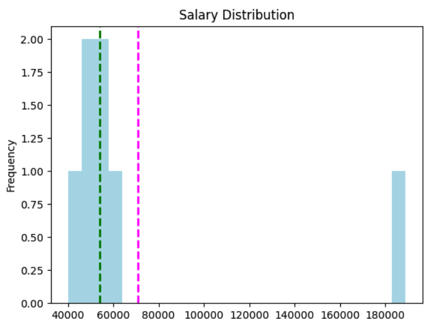

Here's an interpretation of this graph:

- The `mean` is the magenta dashed line
- The `median` is the green dashed line
- _Salary_ is a continuous data value - graduates could potentially earn any value along the scale, even down to a fraction of cent.
- The number of bins in the histogram determines the size of each salary band for which we're counting frequencies. Fewer bins means merging more individual salaries together to be counted as a group.
- The majority of the data is on the left side of the histogram, reflecting the fact that most graduates earn between 40,000 and 55,000
- The mean is a higher value than the median and mode.
- There are gaps in the histogram for salary bands that nobody earns.

Let's see a new example to understand the density and the distribution.

| Name     | Grade |
| -------- | ----- |
| Dan      | 50    |
| Joann    | 50    |
| Pedro    | 46    |
| Rosie    | 95    |
| Ethan    | 50    |
| Vicky    | 5     |
| Frederic | 57    |

Let's plot this data with Python and check the shape of the distribution:

```python
import pandas as pd
import matplotlib.pyplot as plt
import numpy as np
import scipy.stats as stats

df = pd.DataFrame({'Name': ['Dan', 'Joann', 'Pedro', 'Rosie', 'Ethan', 'Vicky', 'Frederic'],
                   'Grade':[50,50,46,95,50,5,57]})

grade = df['Grade']
density = stats.gaussian_kde(grade)
n, x, _ = plt.hist(grade, histtype='step', bins=25)
plt.plot(x, density(x)*7.5)
plt.axvline(grade.mean(), color='magenta', linestyle='dashed', linewidth=2)
plt.axvline(grade.median(), color='green', linestyle='dashed', linewidth=2)
plt.show()
```

It plots this graph:

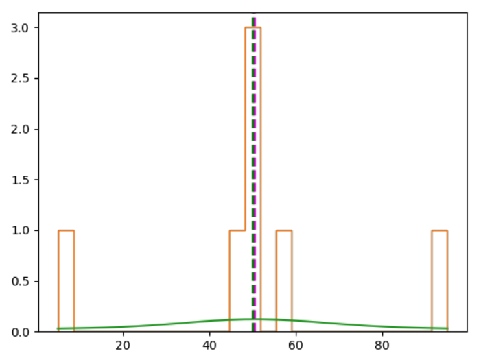

It forms this bell-shaped curve. It's usually called a "normal distribution", or Gaussian distribution.

#### Variance

We have different ways of quantifying the variance in a dataset:

- **range**: the difference between the highest and lowest values
- **percentile**: the ranking of a value in the overall distribution. e.g. 25% of the data in a distribution has a value lower than the 25th percentile
- **quartiles**: divide the percentiles in 4 slots (quartiles) - 0 > 25% > 50% > 75%

#### Standard Deviation

Variance is measured as the average of the squared difference from the mean.

For full population, we calculate with this formula:

$$
\begin{equation}\sigma^{2} = \frac{\displaystyle\sum_{i=1}^{N} (X_{i} -\mu)^{2}}{N}\end{equation}
$$

For a sample:

$$
\begin{equation}s^{2} = \frac{\displaystyle\sum_{i=1}^{n} (x_{i} -\bar{x})^{2}}{n-1}\end{equation}
$$

As an example, let's calculate the variance for the grades data.

First we need to calculate the mean

$$
\begin{equation}\bar{x} = \frac{50+50+46+95+50+5+57}{7}\approx 50.43\end{equation}
$$

Then apply it to the variance formula:

$$
\begin{equation}s^{2} = \frac{(50-50.43)^{2}+(50-50.43)^{2}+(46-50.43)^{2}+(95-50.43)^{2}+(50-50.43)^{2}+(5-50.43)^{2}+(57-50.43)^{2}}{7-1}\end{equation}
$$

Resulting in:

$$
\begin{equation}s^{2} \approx 685.619\end{equation}
$$

In Python, we can use the method `var`:

```python
import pandas as pd

df = pd.DataFrame({'Name': ['Dan', 'Joann', 'Pedro', 'Rosie', 'Ethan', 'Vicky', 'Frederic'],
                   'Salary':[50000,54000,50000,189000,55000,40000,59000],
                   'Hours':[41,40,36,17,35,39,40],
                   'Grade':[50,50,46,95,50,5,57]})

df['Grade'].var() # 685.6190476190476
```

The higher the variance, the more spread your data is around the mean.

In the variance calculation, we square the difference from the mean. That way, we are in a different unit of measurement as the original data.

To get the measure of variance back into the same unit of measurement, we need to find its square root:

$$
\begin{equation}s = \sqrt{685.619} \approx 26.184\end{equation}
$$

This represents the standard deviation.

$$
\begin{equation}s = \sqrt{\frac{\displaystyle\sum_{i=1}^{n} (x_{i} -\bar{x})^{2}}{n-1}}\end{equation}
$$

In Python, we have the `std` method to calculate the standard deviation:

```python
df = pd.DataFrame({'Name': ['Dan', 'Joann', 'Pedro', 'Rosie', 'Ethan', 'Vicky', 'Frederic'],
                   'Salary':[50000,54000,50000,189000,55000,40000,59000],
                   'Hours':[41,40,36,17,35,39,40],
                   'Grade':[50,50,46,95,50,5,57]})

print(df['Grade'].std()) # 26.184328282754315
```

Let's plot a histogram of a standard normal distribution in Python:

```python
import pandas as pd
import matplotlib.pyplot as plt
import numpy as np
import scipy.stats as stats

# Create a random standard normal distribution
df = pd.DataFrame(np.random.randn(100000, 1), columns=['Grade'])

# Plot the distribution as a histogram with a density curve
grade = df['Grade']
density = stats.gaussian_kde(grade)
n, x, _ = plt.hist(grade, color='lightgrey', bins=100)
plt.plot(x, density(x))

# Get the mean and standard deviation
std = df['Grade'].std()
mean = df['Grade'].mean()

# Annotate 1 stdev
x1 = [mean-std, mean+std]
y1 = [0.25, 0.25]
plt.plot(x1,y1, color='magenta')
plt.annotate('1s (68.26%)', (x1[1],y1[1]))

# Annotate 2 stdevs
x2 = [mean-(std*2), mean+(std*2)]
y2 = [0.05, 0.05]
plt.plot(x2,y2, color='green')
plt.annotate('2s (95.45%)', (x2[1],y2[1]))

# Annotate 3 stdevs
x3 = [mean-(std*3), mean+(std*3)]
y3 = [0.005, 0.005]
plt.plot(x3,y3, color='orange')
plt.annotate('3s (99.73%)', (x3[1],y3[1]))

# Show the location of the mean
plt.axvline(grade.mean(), color='grey', linestyle='dashed', linewidth=1)
plt.show()
```

Here's the graph:

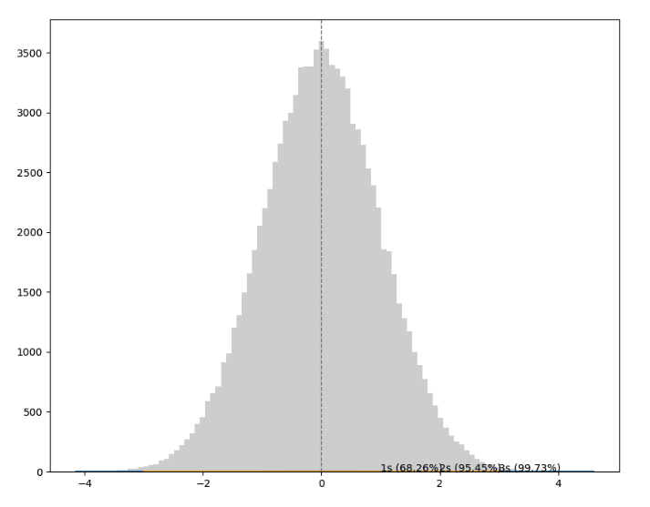

In any normal distribution:

- Approximately 68.26% of values fall within one standard deviation from the mean.
- Approximately 95.45% of values fall within two standard deviations from the mean.
- Approximately 99.73% of values fall within three standard deviations from the mean.

With all this knowledge, we have a simple way of getting all this information in Python. We use the `describe` method from pandas.

```python
import pandas as pd

df = pd.DataFrame({'Name': ['Dan', 'Joann', 'Pedro', 'Rosie', 'Ethan', 'Vicky', 'Frederic'],
                   'Salary':[50000,54000,50000,189000,55000,40000,59000],
                   'Hours':[41,40,36,17,35,39,40],
                   'Grade':[50,50,46,95,50,5,57]})

df.describe()
#               Salary      Hours      Grade
# count       7.000000   7.000000   7.000000
# mean    71000.000000  35.428571  50.428571
# std     52370.475143   8.423324  26.184328
# min     40000.000000  17.000000   5.000000
# 25%     50000.000000  35.500000  48.000000
# 50%     54000.000000  39.000000  50.000000
# 75%     57000.000000  40.000000  53.500000
# max    189000.000000  41.000000  95.000000
```

### Comparing Data

Comparing data is important so we can find trends and relationships among them.

When we talk about comparing data, we have two different types of data

- **Univariate data**: when we have only one variable
- **Bivariate or Multivariate data**: when we have more than 1 variable in the dataset

#### Bivariate or Multivariate data

When comparing multiple variables, the difficult is to have them in different scales.

Let's see this in practice with Python:

```python
import pandas as pd
from matplotlib import pyplot as plt

df = pd.DataFrame({'Name': ['Dan', 'Joann', 'Pedro', 'Rosie', 'Ethan', 'Vicky', 'Frederic', 'Jimmie', 'Rhonda', 'Giovanni', 'Francesca', 'Rajab', 'Naiyana', 'Kian', 'Jenny'],
                   'Salary':[50000,54000,50000,189000,55000,40000,59000,42000,47000,78000,119000,95000,49000,29000,130000],
                   'Hours':[41,40,36,17,35,39,40,45,41,35,30,33,38,47,24],
                   'Grade':[50,50,46,95,50,5,57,42,26,72,78,60,40,17,85]})


df.plot(kind='box', title='Distribution', figsize = (10,8))
plt.show()
```

Here we plot the data of salary, hours, and grades in the same graph, but the 3 are in different scales.

It's clear in the following graph that the salary data is so much bigger than the hours and grades data making it difficult to draw any conclusion from the graph.

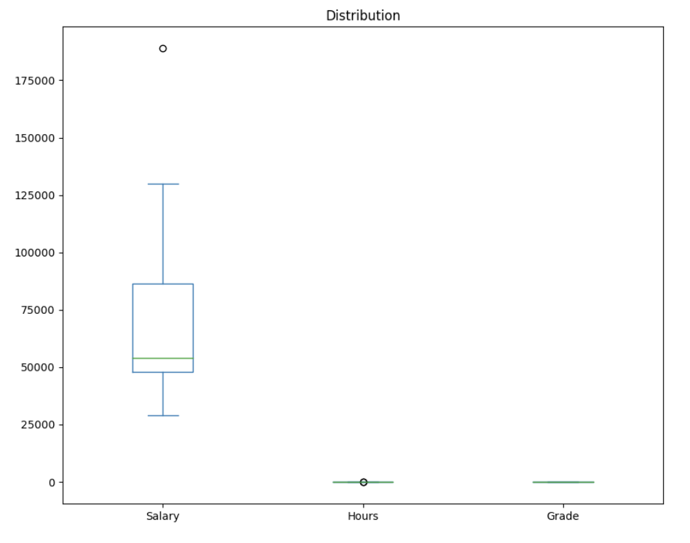

To make the data and the graph more understandable, we normalize the data to compare different units of measurement.

In Python, we can use the `MinMaxScaler` from `sklearn` to normalize the data:

```python
import pandas as pd
from matplotlib import pyplot as plt
from sklearn.preprocessing import MinMaxScaler

df = pd.DataFrame({'Name': ['Dan', 'Joann', 'Pedro', 'Rosie', 'Ethan', 'Vicky', 'Frederic', 'Jimmie', 'Rhonda', 'Giovanni', 'Francesca', 'Rajab', 'Naiyana', 'Kian', 'Jenny'],
                   'Salary':[50000,54000,50000,189000,55000,40000,59000,42000,47000,78000,119000,95000,49000,29000,130000],
                   'Hours':[41,40,36,17,35,39,40,45,41,35,30,33,38,47,24],
                   'Grade':[50,50,46,95,50,5,57,42,26,72,78,60,40,17,85]})

# Normalize the data
scaler = MinMaxScaler()
df[['Salary', 'Hours', 'Grade']] = scaler.fit_transform(df[['Salary', 'Hours', 'Grade']])

# Plot the normalized data
df.plot(kind='box', title='Distribution', figsize = (10,8))
plt.show()
```

Here's the new graph with the data normalized making it easier to interpret it:

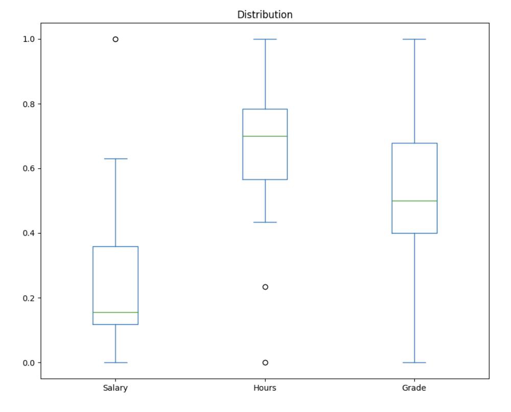

#### Scatter plot

To compare numeric values, scatter plots can be very useful to check apparent relationship between them.

Let's code this scatter plot graph:

```python
import pandas as pd
from matplotlib import pyplot as plt

df = pd.DataFrame({'Name': ['Dan', 'Joann', 'Pedro', 'Rosie', 'Ethan', 'Vicky', 'Frederic', 'Jimmie', 'Rhonda', 'Giovanni', 'Francesca', 'Rajab', 'Naiyana', 'Kian', 'Jenny'],
                   'Salary':[50000,54000,50000,189000,55000,40000,59000,42000,47000,78000,119000,95000,49000,29000,130000],
                   'Hours':[41,40,36,17,35,39,40,45,41,35,30,33,38,47,24],
                   'Grade':[50,50,46,95,50,5,57,42,26,72,78,60,40,17,85]})

# Create a scatter plot of Salary vs Grade
df.plot(kind='scatter', title='Grade vs Hours', x='Grade', y='Salary')
plt.show()
```

If we look close, we can see a pattern in the graph, a diagonal rising to the right. In other words, the higher the grade, the higher the salary is.

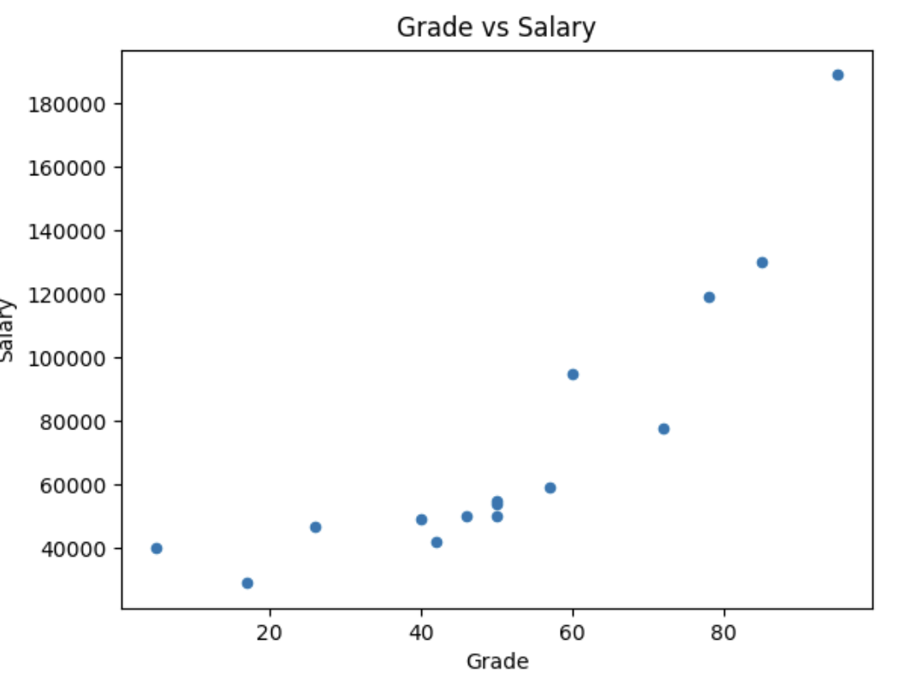

If it's not clear for you, we can draw the _line of best fit_ (trendline) in the graph to make it easier.

```python
import pandas as pd
import numpy as np
from matplotlib import pyplot as plt

df = pd.DataFrame({'Name': ['Dan', 'Joann', 'Pedro', 'Rosie', 'Ethan', 'Vicky', 'Frederic', 'Jimmie', 'Rhonda', 'Giovanni', 'Francesca', 'Rajab', 'Naiyana', 'Kian', 'Jenny'],
                   'Salary':[50000,54000,50000,189000,55000,40000,59000,42000,47000,78000,119000,95000,49000,29000,130000],
                   'Hours':[41,40,36,17,35,39,40,45,41,35,30,33,38,47,24],
                   'Grade':[50,50,46,95,50,5,57,42,26,72,78,60,40,17,85]})

# Create a scatter plot of Salary vs Grade
df.plot(kind='scatter', title='Grade vs Salary', x='Grade', y='Salary')

# Add a line of best fit
plt.plot(np.unique(df['Grade']), np.poly1d(np.polyfit(df['Grade'], df['Salary'], 1))(np.unique(df['Grade'])))
plt.show()
```

This Python code generates this graph with the trendline:

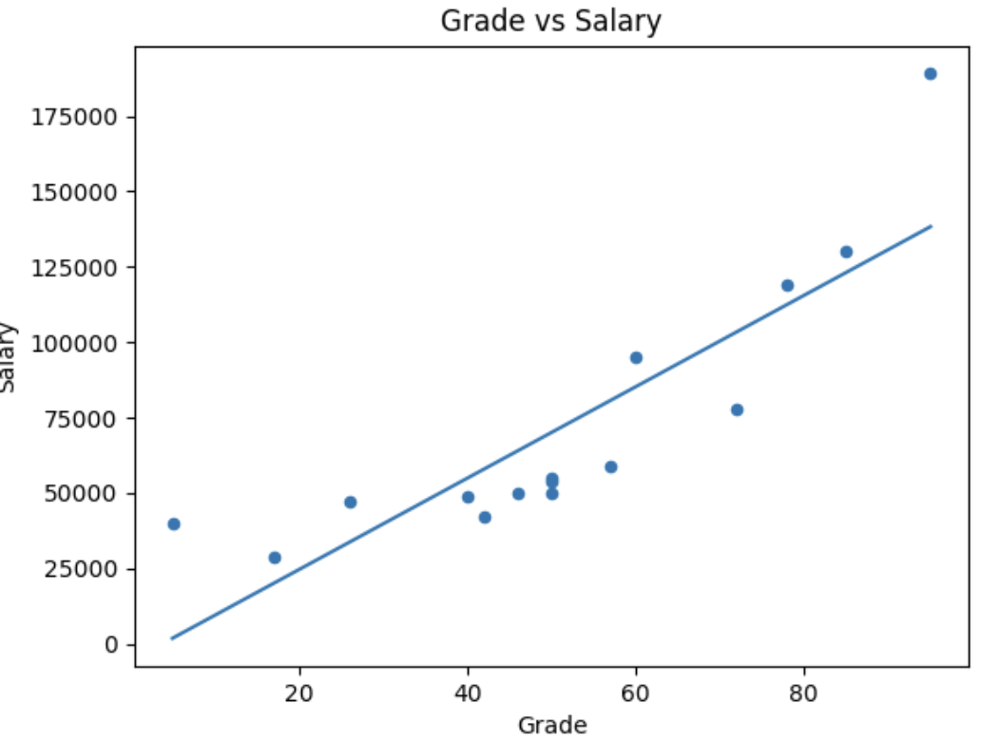

The line of best fit makes it clearer that there is some apparent _colinearity_ between these variables (the relationship is _colinear_ if one variable's value increases or decreases in line with the other).

#### Correlation

We can spot the relationship of variables in a graph but if we want to quantify the relationship between two variables, we can use the idea of _correlation_.

The _correlation_ value is always a number between -1 and 1. This is how we interpret it:

- A positive value indicates a positive correlation (as the value of variable _x_ increases, so does the value of variable _y_).
- A negative value indicates a negative correlation (as the value of variable _x_ increases, the value of variable _y_ decreases).
- The closer to zero the correlation value is, the weaker the correlation between _x_ and _y_.
- A correlation of exactly zero means there is no apparent relationship between the variables.

The formula to calculate correlation is:

$$
\begin{equation}r_{x,y} = \frac{\displaystyle\sum_{i=1}^{n} (x_{i} -\bar{x})(y_{i} -\bar{y})}{\sqrt{\displaystyle\sum_{i=1}^{n} (x_{i} -\bar{x})^{2}(y_{i} -\bar{y})^{2}}}\end{equation}
$$

The r𝓍,𝔂 is the notion for the correlation between variables x and y.

In Python, we can calculate the correlation using the `corr` method from Pandas.

```python
df = pd.DataFrame({'Name': ['Dan', 'Joann', 'Pedro', 'Rosie', 'Ethan', 'Vicky', 'Frederic'],
                   'Salary':[50000,54000,50000,189000,55000,40000,59000],
                   'Hours':[41,40,36,17,35,39,40],
                   'Grade':[50,50,46,95,50,5,57]})

df['Grade'].corr(df['Salary']) # 0.8149286388911882
```

#### Least squares regression

Linear equations look like this:

$$
\begin{equation}y = mx + b\end{equation}
$$

_y_ and _x_ are the coordinate variables, _m_ is the slope of the line, and _b_ is the y-intercept of the line.

The difference between the original _y_ (_Hours_) value and the _f(x)_ value is the _error_ between our regression line of best fit and the actual _Hours_.

The first part is to calculate the slope and intercept for a line with the lowest overall error.

And then we define the overall error by taking the error for each point, squaring it, and adding all the squared errors together. The line of best fit is the line that gives us the lowest value for the sum of the squared errors - _least squares regression_.

Here's how we calculate the slope (_m_), which we do using this formula (in which _n_ is the number of observations in our data sample):

$$
\begin{equation}m = \frac{n(\sum{xy}) - (\sum{x})(\sum{y})}{n(\sum{x^{2}})-(\sum{x})^{2}}\end{equation}
$$

After we've calculated the slope (_m_), we can use is to calculate the intercept (_b_) like this:

$$
\begin{equation}b = \frac{\sum{y} - m(\sum{x})}{n}\end{equation}
$$

If we take this dataset as an example:

| Name     | Study | Grade |
| -------- | ----- | ----- |
| Dan      | 1     | 50    |
| Joann    | 0.75  | 50    |
| Pedro    | 0.6   | 46    |
| Rosie    | 2     | 95    |
| Ethan    | 1     | 50    |
| Vicky    | 0.2   | 5     |
| Frederic | 1.2   | 57    |

First, let's take each _x_ (Study) and _y_ (Grade) pair and calculate _x<sup>2</sup>_ and _xy_, and the sum, because we're going to need these to work out the slope:

| Name        | Study    | Grade   | x<sup>2</sup> | xy        |
| ----------- | -------- | ------- | ------------- | --------- |
| Dan         | 1        | 50      | 1             | 50        |
| Joann       | 0.75     | 50      | 0.55          | 37.5      |
| Pedro       | 0.6      | 46      | 0.36          | 27.6      |
| Rosie       | 2        | 95      | 4             | 190       |
| Ethan       | 1        | 50      | 1             | 50        |
| Vicky       | 0.2      | 5       | 0.04          | 1         |
| Frederic    | 1.2      | 57      | 1.44          | 68.4      |
| **&Sigma;** | **6.75** | **353** | **8.4025**    | **424.5** |

Here's how we calculate the slope

$$
\begin{equation}m = \frac{588.75}{13.255} \approx 44.4172\end{equation}
$$

And here's how we calculate the intercept

$$
\begin{equation}b = \frac{53.18389}{7} = 7.597699\end{equation}
$$

Now we have our linear function:

$$
\begin{equation}f(x) = mx + b = 44.4172x + 7.597699\end{equation}
$$

We can use this for each _x_ (Study) value to calculate the _y_ values for the regression line (_f(x)_), and we can subtract the original _y_ (Grade) from these to calculate the error for each point:

| Name     | Study | Grade | _f(x)_  | Error   |
| -------- | ----- | ----- | ------- | ------- |
| Dan      | 1     | 50    | 52.0149 | 2.0149  |
| Joann    | 0.75  | 50    | 40.9106 | -9.0894 |
| Pedro    | 0.6   | 46    | 34.2480 | -11.752 |
| Rosie    | 2     | 95    | 96.4321 | 1.4321  |
| Ethan    | 1     | 50    | 52.0149 | 2.0149  |
| Vicky    | 0.2   | 5     | 16.4811 | 11.4811 |
| Frederic | 1.2   | 57    | 60.8983 | 3.8983  |

Now let's plot the regression line in the graph

```python
import pandas as pd
import numpy as np
from matplotlib import pyplot as plt

df = pd.DataFrame({'Name': ['Dan', 'Joann', 'Pedro', 'Rosie', 'Ethan', 'Vicky', 'Frederic'],
                   'Study':[1,0.75,0.6,2,1,0.2,1.2],
                   'Grade':[50,50,46,95,50,5,57],
                   'fx':[52.0159,40.9106,34.2480,96.4321,52.0149,16.4811,60.8983]})

# Create a scatter plot of Study vs Grade
df.plot(kind='scatter', title='Study Time vs Grade Regression', x='Study', y='Grade', color='red')

# Plot the regression line
plt.plot(df['Study'],df['fx'])
plt.show()
```

Now we have this graph:

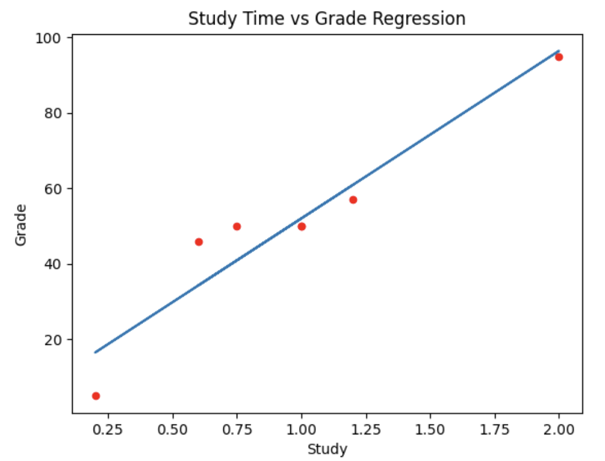

### Probability

#### Probability Basics

Some basic definitions and principles:

- An **_experiment_** or **_trial_** is an action with an uncertain outcome, such as tossing a coin.
- A **_sample space_** is the set of all possible outcomes of an experiment. In a coin toss, there's a set of two possible oucomes (_heads_ and _tails_).
- A **_sample point_** is a single possible outcome - for example, _heads_)
- An **_event_** is a specific outome of single instance of an experiment - for example, tossing a coin and getting _tails_.
- **_Probability_** is a value between 0 and 1 that indicates the likelihood of a particular event, with 0 meaning that the event is impossible, and 1 meaning that the event is inevitable.

$$
\begin{equation}\text{probability of an event} = \frac{\text{Number of sample points that produce the event}}{\text{Total number of sample points in the sample space}} \end{equation}
$$

- Talk about the probability notation
- Talk about the probability of complement
- Bias
  - e.g. weather forecast. sunny vs rainy vs cloudy days: different probabilities in all of them

#### Conditional Probability and Dependence

Events can be:

- _Independent_ (events that are not affected by other events)
- _Dependent_ (events that are conditional on other events)
- _Mutually Exclusive_ (events that can't occur together)

In independent events, the probability of different events doesn't dependent on previous events.

- Show: example of coin toss
  - the probaility of getting heads is 1/2. for sequential events, the probability will keep the same, 50%, independent from the previous events.
  - show: python code of coin toss probability
  - image plot

In independent events combination, we have a different problem. For example, what is the probability of getting three heads in a row?

- To combine these independent events, we need to multiply the probability of each event
- 1/2 · 1/2 · 1/2 = 0.125, or 12.5%
- show: python code - probability of getting 3 heads in a row

Intersection and Unions

- Show: the notation for the combined event probability
- The intersection, the symbol represents "and"
  - show: equation of the intersection of events A and B
- The union, the symbol represents "or"
  - subtract the probability of A ⋂ B to avoid double-counting
  - show: equation of the union of events A and B

<div style='text-align:center'>Event A<span style='font-size:120px'>&#9901;</span>Event B</div>

Dependent events

- deck of cards has 52 cards
  - 13 spades (black cards)
  - 13 clubs (black cards)
  - 13 hearts (red cards)
  - 13 diamonds (red cards)
- the probability of getting a black card is (13 + 13) / 52
- the probability of getting a red card is (13 + 13) / 52
- after getting one card and not replacing it back to the deck of cards, the probability of getting a new cards changes
  - for black cards: (13 + 13) / 51 (now with 51 cards in the deck)
  - for red cards: (13 + 12) / 51 (now with 51 cards in the deck and only 12 of one of the red cards)
- One event is affecting another, this is called dependent events
- the notation for dependent events
  - the probability of B given A
    - given that the event A happended, what's the probability of the event B
  - show: formula

Mutually exclusive events

- when events don't occur at the same time
- e.g. coin toss getting heads and tails
- the intersection of a mutually exclusive event is always 0
- the union is the sum of the two events, there's no need for the subtractation of the intersection because the intersection of mutually exclusive events are always 0

Binomial variables

- what's binomial variables
- formula and show an example of using the formula
