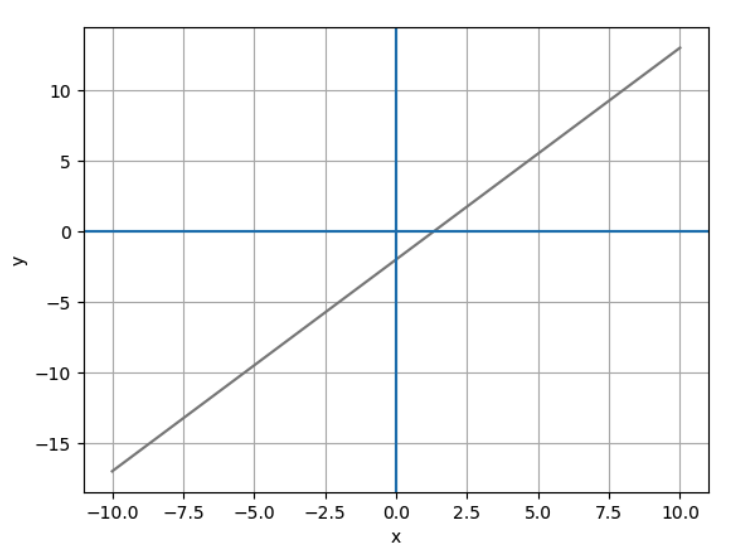

# Math for Machine Learning with Python

## Algebra Fundamentals: Equations, Graphs, and Functions

Starting with an equation: `2x + 3 = 9` to find the the `x`. `x = 3`

```python
x = -41
x + 16 == -25 # True
```

Working with fractions

```python
x = 45
x / 3 + 1 == 16 # True
```

Variables in both sides

```python
x = 1.5
3 * x + 2 == 5 * x -1 # True
```

Creating a dataframe with the `x` and `y` columns and their values

```python
import pandas as pd
from matplotlib import pyplot as plt

df = pd.DataFrame({'x': range(-10, 11)})
df['y'] = (3 * df['x'] - 4) / 2
```

Simple way to plot and show the graph

```python
plt.plot(df.x, df.y, color="grey")
plt.xlabel('x')
plt.ylabel('y')
plt.grid()
plt.show()
```



Annotate the points when x = 0 and y = 0

```python
plt.annotate('x-intercept', (1.333, 0))
plt.annotate('y-intercept', (0, -2))
plt.show()
```


Finding the slope through the equation:

```
slope = Δy/Δx
```

Slope is usually represented by the letter `m`

```
m = (y2 - y1) / (x2 - x1)
```

Getting these two points, we can infer the slope value: (0, -2), (6, 7)

```
m = (7 - (-2)) / (6 - 0)
m = 1.5
```

It means that when moving one unit to the right (x-axis), we need to move 1.5 units up (y-axis) to get back to the line.

```python
m = 1.5
yInt = -2
mx = [0, 1]
my = [yInt, yInt + m]
```

In equations with two variables `x` and `y`, we can use elimination to find the values when the intersect with each other

```
x + y = 16
10x + 25y = 250
```

With elimination, you'll find out that `x = 10` and `y = 6` when the lines intersect.

```python
x = 10
y = 6
print((x + y == 16) & ((10 * x) + (25 * y) == 250))
```

When plotting the lines of those equations, we get this graph


Here's how we generate the code

```python
chipsAll10s = [16, 0]
chipsAll25s = [0, 16]

valueAll10s = [25, 0]
valueAll25s = [0, 10]

plt.plot(chipsAll10s, chipsAll25s, color='blue')
plt.plot(valueAll10s, valueAll25s, color="orange")
plt.xlabel('x (£10 chips)')
plt.ylabel('y (£25 chips)')
plt.grid()

plt.show()
```

Exponatials have a simple case that's squaring a number: `2² = 2 x 2 = 4`.

```python
2 ** 2 # 4
```

Radicals (roots) is useful to calculate a solution for exponential

```
?² = 9
√9 = 3
∛64 = 4
```

In Python we can use `math.sqrt` to get the square root of a number and a trick to get the cube root.

```python
math.sqrt(25) # 5
round(64 ** (1. / 3)) # 64 ^ 1/3 = ∛64 = 4
```

To find the exponent for a given number and base, we use the logarithm

```
4 ^ ? = 16
log₄(16) = 2
```

The `math` module has a `log` function that receive the number and the base

```python
math.log(16, 4) # 2.0
math.log(29) # 3.367295829986474
math.log10(100) # 2.0
```

Solving equations with exponentials:

```
2y = 2(x^4)((x^2 + 2x^2) / x^3)
2y = 2(x^4)(3x^2 / x^3)
2y = 2(x^4)(3x^-1)
2y = 6(x^3)
y = 3(x^3)
```

We can exemplify this with Python

```python
df = pd.DataFrame ({'x': range(-10, 11)})

# add a y column by applying the slope-intercept equation to x
df['y'] = 3 * df['x'] ** 3 # this is the equation we simplified above

plt.plot(df.x, df.y, color="magenta")
plt.xlabel('x')
plt.ylabel('y')
plt.grid()
plt.axhline()
plt.axvline()
plt.show()
```

It generates this graph:


